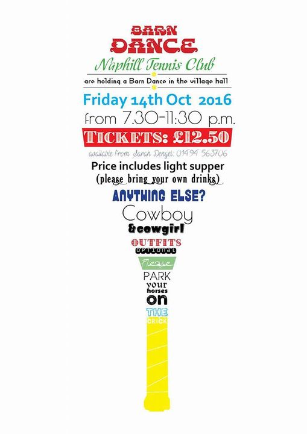
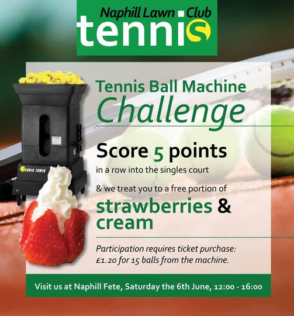

  
<!-- <h2>Introduction to Project</h2> -->

Volunteering project. 
The site has been in use years 2014-2022 where I helped updating the content on regular basis and improving. My second website I published. 

  

<!-- <h2>Branding</h2> -->

Given a free hand to style colours, fonts and logo I was really happy to create professional looking site for a small village club.

  

<!-- <h2>Content</h2> -->

The site has few content ideas created to help promote the club in a positive fun way. Home page for example has a short (music) video explaining aspects of tennis and way people should play tennis encouraging for try out games. Posters for upcoming and past events are also included. Really enjoyed video editing, as this was first one of my first attempts on video editing using Windows Video Editor.

<h3>Video <i><b>What is Tennis?</b></i></h3>

Posters:
  

  

  

<!-- <h2>Front End</h2> -->

For front end: Next JS. 

 
To gather data from the forms: React-Hook-Forms. 

 

Icons used at the bottom of the page: FontAwesome. 

  

<!-- <h2>Back End</h2> -->

Back end is solved using API part of Next JS with MYSQL database installed and running on Raspberry Pi 4 with remote access enabled.
 

 

  

<!-- <h2>SEO</h2> -->

SEO was focused on local searches in High Wycombe/Buckinghamshire area, for anyone enquirying about tennis coaching, playing tennis for various age groups. 

The name of the club is incorporated into url, for anyone looking for Naphill Tennis Club.

  

<!-- <h2>Used Libraries & Hooks</h2> -->

  

<!-- <h2>Challenges of the project</h2> -->

  

<a href="https://naphill-tennis-club.vercel.app/">
Naphill Tennis Club site </a>

