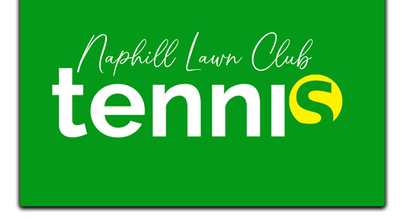

<h1>Naphill tennis club</h1>

<h2>Introduction to Project</h2>

Volunteering project. 
The site has been in use years 2014-2022 where I helped updating the content on regular basis and improving. My second website I published. 

<h2>Branding</h2>

Given a free hand to style colours, fonts and logo I was really happy to create professional looking site for a small village club.

<h2>Content</h2>

The site has few content ideas created to help promote the club in a positive fun way. Home page for example has a short (music) video explaining aspects of tennis and way people should play tennis encouraging for try out games. 

[Video](public/Media/videos/What-is-Tennis-by-Lucy-de-Rojas.mp4)
What-is-Tennis-by-Lucy-de-Rojas.mp4

<h2>Front End</h2>

<h2>Back End</h2>

<h2>SEO</h2>

<h2>Used Libraries & Hooks</h2>

<a href="https://naphill-tennis-club.vercel.app/">See website</a>

